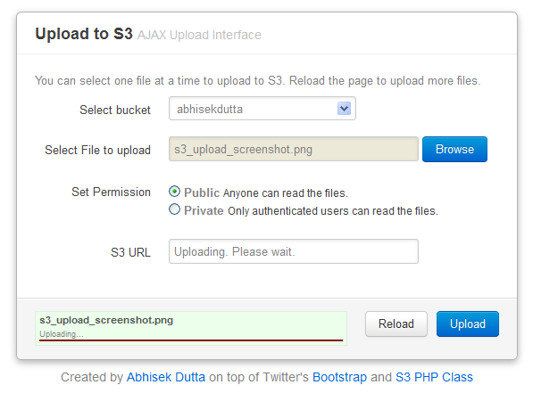

ZenS3 is a simple ajax upload interface for Amazon's Simple Storage Service. It is meant for those who want to **share files quickly using S3**. It is built on top of Twitter's [Bootstrap](https://github.com/twitter/bootstrap) and [Amazon S3 PHP Class](https://github.com/tpyo/amazon-s3-php-class). The awesome [SWFUpload](http://swfupload.org) library handles the AJAX uploads.
### Installation
This is a plug-n-play app. Just feed the config.php file with your AWS key and secret. Upload it to your server and enjoy!
### How it works
You can select from a number of buckets where you want to upload. You can decide whether you want to share files with public or with authenticated users only. If you select to share with authenticated users only, you'd receive an authenticated URL. If shared with public, you'd get public URL. In both cases (public or private), anyone who has S3 upload URL can only _read_ the files.
### Caveat
ZenS3 doesn't have any authentication mechanism. So anyone who has the URL of a ZenS3 installation can access and upload files to your buckets! You may want to install it on your local server and access it whenever you like. Or integrate it with another project.
### Issues
This is a very simple upload interface built in an hour.

-    Cannot handle mutiple file uploads
-    Once the first upload is complete, cannot upload again without refreshing the page